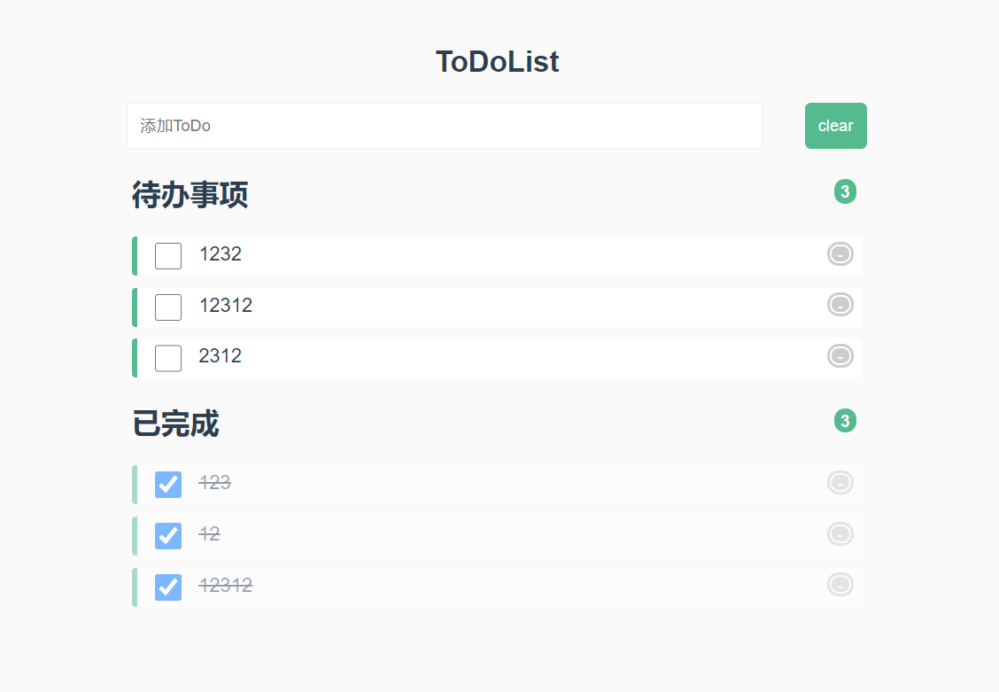

# vue-miniProject-ToDoList

> 基于vue2.0实现的todolist功能  
> 详细说明地址：https://blog.csdn.net/qq_33094147/article/details/115386252
## 实现功能
- 在文本框输入后按enter添加待办事项
- 添加后显示在待办事项中
- 完成后勾选check框，从待办事项中移除，显示在已完成中
- 待办事项和已完成的计数功能
- 删除单条待办事项
- 按键clear清除所有事项
- 保存在本地localStorage中

## 实现说明
使用vue-cli创建项目后，将src文件夹替换。
```
npm install --global vue-cli
vue init webpack my-project
cd my-project
npm install
npm run dev
```

## 最终效果

